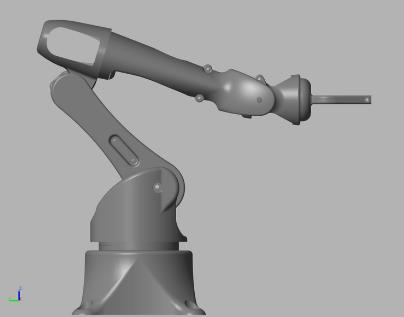
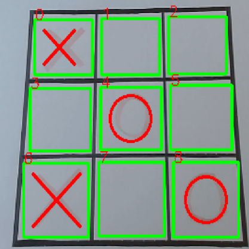

# Corrado - The Tic-Tac-Toe Robot Player

	

## Abstract

This project involves creating an anthropomorphic robot with a spherical wrist designed to play Tic-Tac-Toe. It features a control algorithm that enables the robot to draw an 'X' on a game grid. An AI algorithm, combining CNN and computer vision, recognizes the current grid configuration from a camera, while a Minimax algorithm calculates optimal game sequences. The entire system is implemented in a ROS (Robot Operating System) environment.

## Introduction

This project followed a V-cycle development policy, involving design, implementation, and testing phases to ensure direct feedback between design and physical implementation. The development included modeling in Simulink, simulation with MATLAB, and physical assembly with iterative testing using Arduino Raspberry Pi.

## Model

  

### Simscape Implementation

The robot model was imported in Simscape by importing CAD models and defining joints and servomotors. The Simscape model includes a servomotor block that takes desired angles and outputs actuation torques.

## Inverse Kinematics

### Algorithms

Three main inverse kinematics algorithms were explored:
- **Jacobian Pseudo-inverse**
- **Jacobian Transpose**
- **Second-order Algorithms**

### Simulink

Inverse kinematics were implemented using MATLAB Function blocks in Simulink.

	

## Trajectory Planner

### MATLAB Implementation

Trajectory planning was initially done in MATLAB using key points and a trapezoidal profile to define smooth motion for drawing 'X' on the grid.

### ROS Implementation

In ROS, trajectory planning was implemented in Python, defining home position, grid centering, and cell dimensions to draw 'X' on the grid.

  

## Computer Vision

### Grid Extraction and Evaluation

The grid extraction function processes images to identify and sort the grid’s corners and detect colors for efficient letter recognition.

### Letter Recognition

A Convolutional Neural Network (CNN) was used to recognize 'X' and 'O' letters from images. The training involved preparing datasets, defining the CNN architecture, and evaluating model performance.

  

## AI Algorithms

### Minimax Algorithm

The Minimax algorithm evaluates game states to determine the optimal move, aiming to maximize the player's win chances while minimizing the opponent’s.

## ROS Implementation

### Introduction

ROS facilitates the integration of various components like hardware drivers and perception algorithms through a modular architecture.

### MoveIt

MoveIt is used for motion planning and IK solver crucial for controlling the robotic arm’s movements.

### RViz

RViz is used for visualization and debugging, providing a real-time view of the robot's perception and state.

### ROS Communication

ROS uses a node and topic-based communication system, allowing asynchronous information exchange between different components.

## Conclusion

This project integrates robotic control, AI, and computer vision to create a functional Tic-Tac-Toe player. The development process included modeling, simulation, physical assembly, and testing, culminating in a fully operational system.

## Acknowledgements

A special thanks to **[DIYRobotics](https://www.diyrobotics.org)** for the CAD model that we used as the starting point for our project. Their model was instrumental in the design phase, and we made significant modifications to create the final version of Corrado.

